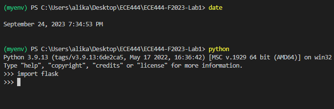
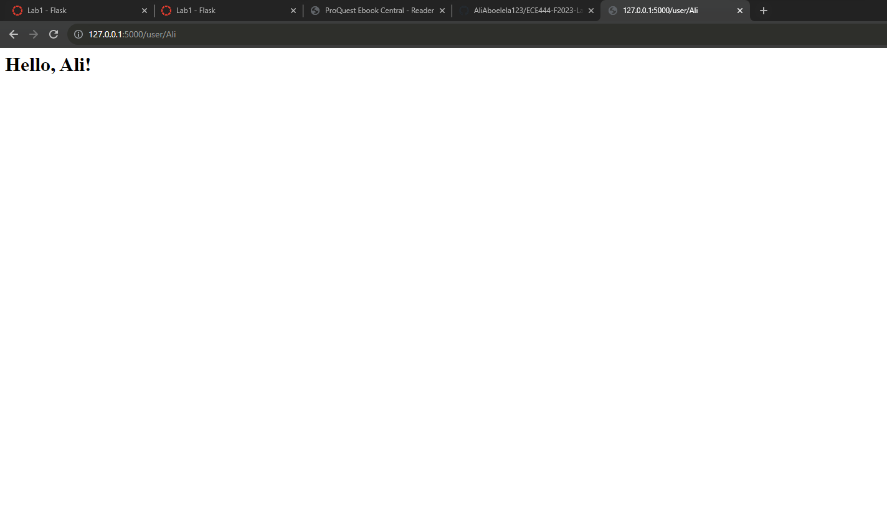
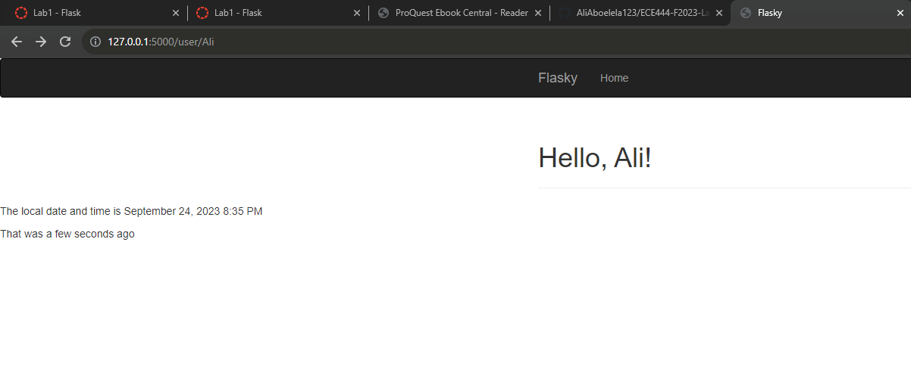
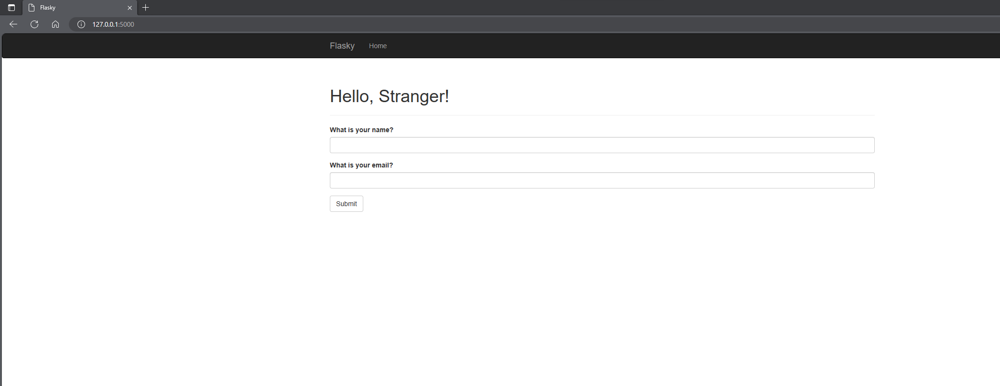
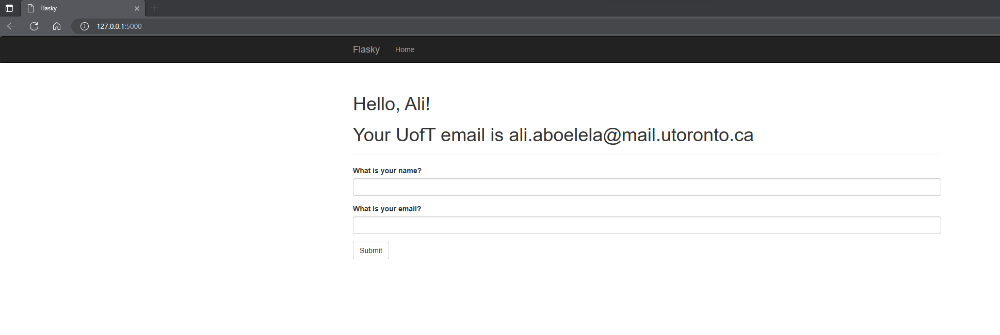
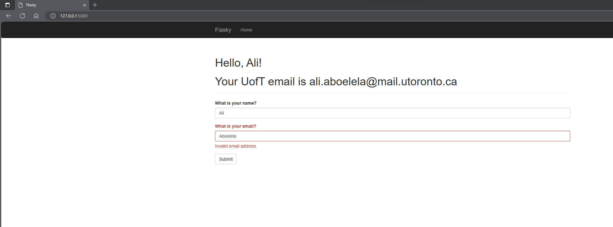
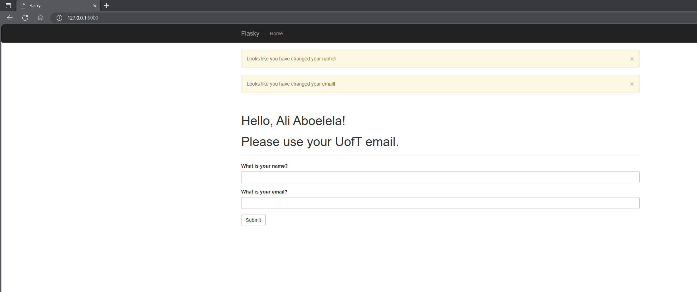

I am Ali Aboelela an ECE student at UofT. This repo is a clone of https://github.com/miguelgrinberg/flasky and is done as a lab exercise.

# Submission

## Activity 1

## Activity 2

## Activity 3

## Activity 4

